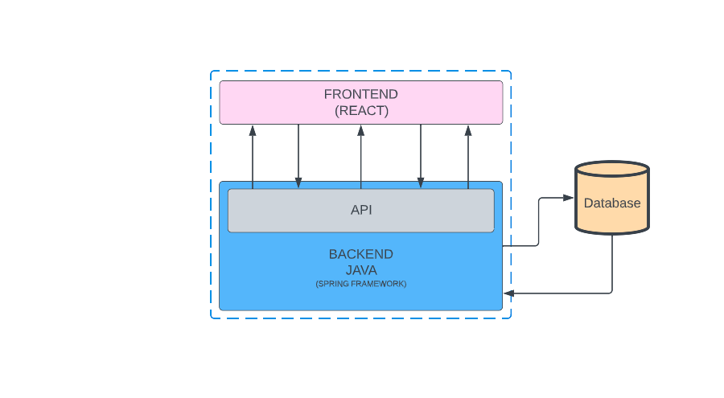
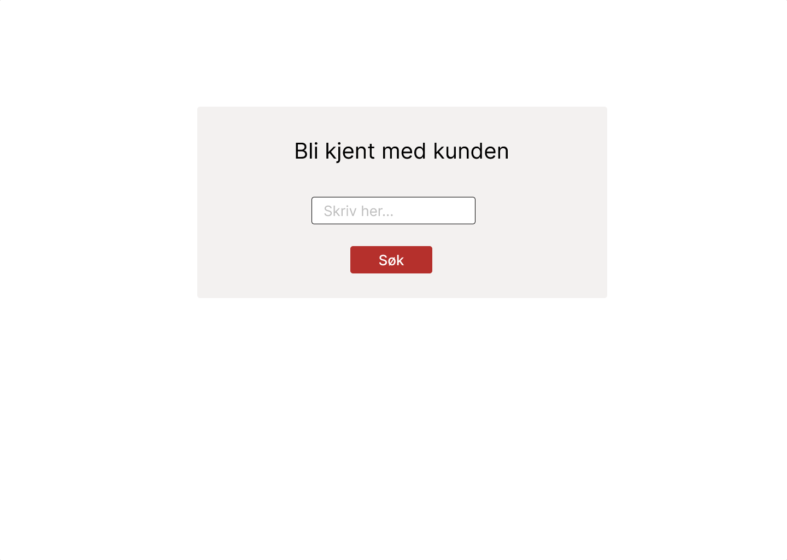
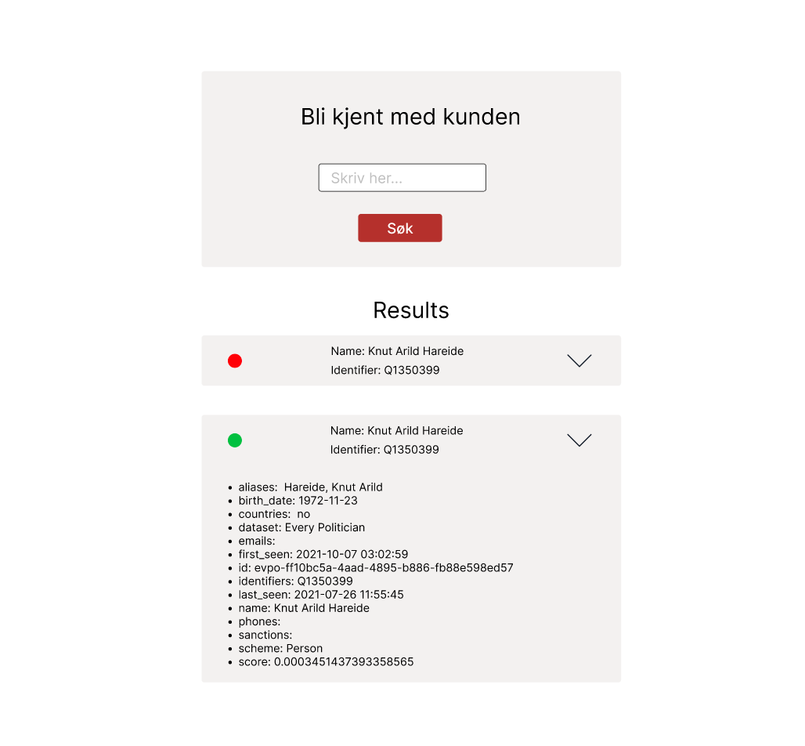

# Stacc code challenge 2021

## Assignment description

Started by brainstorming and doing some scetches. After some time I decided that a visual architecture would help. By using **Lucidcharts** I managed to draw an arcitecture.

After doing this I decided that the most important aspect of the solution would be to get the frontend up and running becase Stacc alredy had a working API up and running at "https://code-challenge.stacc.dev/api/". 

### Design
When designing this I decided that a SPA was the smartest option as this will work as an search engine within the PEP database.

I decided to use FIGMA as the design tool of my choice. By making components, deciding colors and fonts, the implementation would be easier.

### Intro page
- Clean and simple
- Intuitive
- Inspired colors and font from Stacc webpages

### Search result page
- Again clean and simple 
- Accordions to show result
  - Should expand on click
  - Duisplay all information about the search object

## How to run the project

### Frontend
1. Navigate to `/Stacc-KYC-Assignment/frontend`
2. Install dependencies: `npm install`
3. Start the application: `npm run dev`

### Backend
1. Build Project 
2. Navigate to `backend/src/main/java/com/example/demo/TestApplication.java`
  1. Install dependencies: `mvn clean install`
  2. Run project: `mvn spring-boot:run`

### Database
1. Install pymongo: `python3 -m pip install pymongo`
2. ~~Add your IP-address to known ip addresses on: https://cloud.mongodb.com/~~
3. Automaticly connect to db through backend

## Comments

### Design
Even though I could easily have added __NavBar__ and __Footer__ etc. I did not see that necessary since it would all just be superficial with no real functionality. My solution is clean and simple

### Starting with Frontend
As Stacc alredy provided me with a working API, I decided to focus on my weakness, i.e. Frontend. This is because for me setting up the API is not as challenging as creating a working frontend application.

### Styled components
I really like the aspect of a Single File Component and _styled component_ does exactly that. Here one can style the comonents within the same file in a _CLEAN_ manner. 

### DB
The reason I went with MongoDB as the DB was just because I wanted something remote and in the cloud when working with the project. Used python to initialize the db and populate it with the data from pep.csv to show that I can handle python as well.

### Backend
The reason I went with java + Spring Framework was just to show that I can handle java. It would probably be easier to just set it up using Flask, however I used python to populate the data, so java remains.